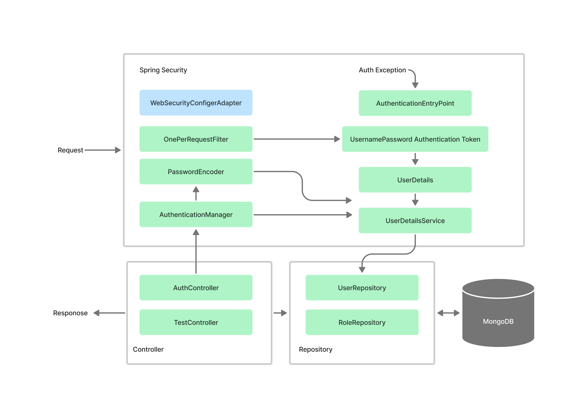
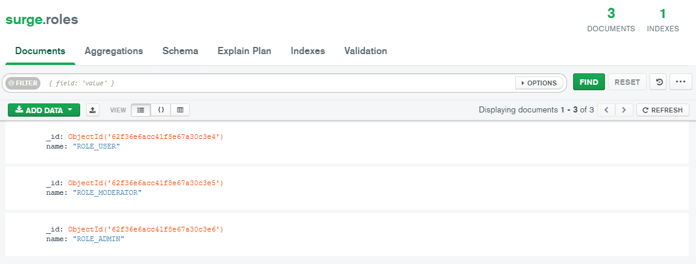
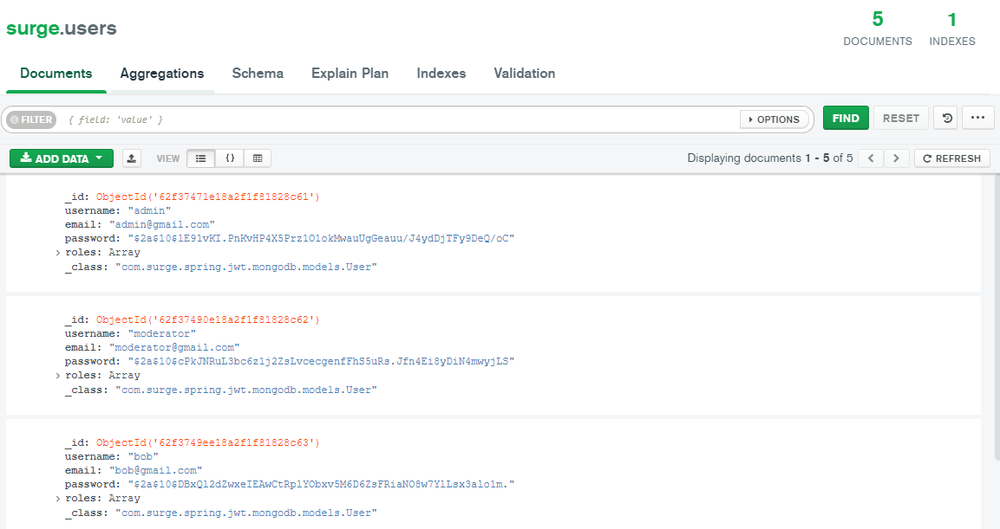
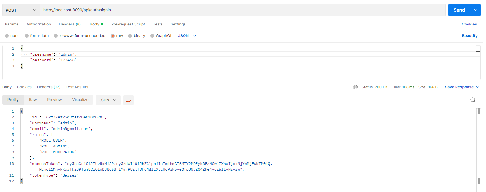

# springboot & react crud application with role-based authentication 


# Overview :globe_with_meridians:
In this application any type of user would be able to perform CRUD operations for the notes functionality where they can save notes which will be saved in the MongoDB compass database. In order to do this the user must first register an account then login and after a successful login the user will be able to see user specifc content. For example : if the user role is the moderator, after loggin in the moderator user can see the moderator dashboard in the navigation bar however the user with a user role would not be able to see that in their navigation bar. All user data will also be stored in MongoDB compass as a seperate collection and their passwords will be encrypeted using base64 and all user data will be stored including the role type.




# Features :white_check_mark:
- Basic CRUD operations
- Role-based authentication with JWT token
- User role specific content
- Search functionality
- Protected routing
- Error handling
- Loading animations
- Dockerized 

## Prerequisites :white_check_mark:
- [x] Installation of Java 8 or above
- [x] Installation of Node (16 LTS)
- [x] Installation of Yarn package manager
- [x] Installation of Maven with path variable added
- [x] MongoDB Compass installed locally on running server in port 27017 (mongodb://localhost:27017)
- [x] Installation of Docker and docker-compose
- [x] Installation of Postman

## Post Installation :computer:
Before getting started we need to first configure some database configurations. Start the backend spring boot application using `mvn spring-boot:run`
Then open your MongoDB compass and open the `MONGOSH` terminal and enter the following commands in order. These commands switches to your database name and then adds `roles` to the roles collection.

```
1. use surge
2. db.roles.insertMany([
   { name: "ROLE_USER" },
   { name: "ROLE_MODERATOR" },
   { name: "ROLE_ADMIN" },
])
``` 

The MongoDB roles collection should look something like this:



Register some users with /signup API using Postman:

- admin with `ROLE_ADMIN`
- moderator with `ROLE_MODERATOR` and `ROLE_USER`
- surge with `ROLE_USER`


After make some user registration, users collection could look like this-



Access public resource: GET `/api/test/all`


Access protected resource: GET `/api/test/user`


Login an account: POST `/api/auth/signin`



Access `ROLE_USER` resource: GET `/api/test/user`


Access `ROLE_MODERATOR` resource: GET `/api/test/mod`


Access `ROLE_ADMIN` resource: GET `/api/test/admin`


---
## Getting Started - Installation :computer:

```
Clone Repository
1.  git clone https://github.com/Chabbax/surge-practical-2022-sep.git

Backend
1.  cd backend
3.  mvn spring-boot:run

Frontend
1.  cd frontend
2.  yarn
3.  yarn start

Docker Compose
1. docker-compose up
(Note: while testing there seems to be an issue with data transfer to the backend and database due to a port issue however the application runs)
```


## Troubleshooting

**Solve Problem: javax.validation cannot be resolved**

For Spring Boot 2.3 and later, you can see the compile error:
`The import javax.validation cannot be resolved`

It is because Validation Starter no longer included in web starters. So you need to add the starter yourself.

– For Maven:
```
<dependency>
  <groupId>org.springframework.boot</groupId>
  <artifactId>spring-boot-starter-validation</artifactId>
</dependency>
```
– For Gradle:
```
dependencies {
  ...
  implementation 'org.springframework.boot:spring-boot-starter-validation'
}
```


**Problem with newer JDK**

If you run this Spring Boot App with JDK 9 or newer versions and get following error when trying to authenticate:
`FilterChain java.lang.NoClassDefFoundError: javax/xml/bind/DatatypeConverter`

Just add following dependency to pom.xml:
```
<dependency>
    <groupId>jakarta.xml.bind</groupId>
    <artifactId>jakarta.xml.bind-api</artifactId>
    <version>2.3.2</version>
</dependency>
```


## Author

- Name : Chandur Dissanayake
- Email: chandur.work@gmail.com
- LinkedIn : https://www.linkedin.com/in/chandur-work/

