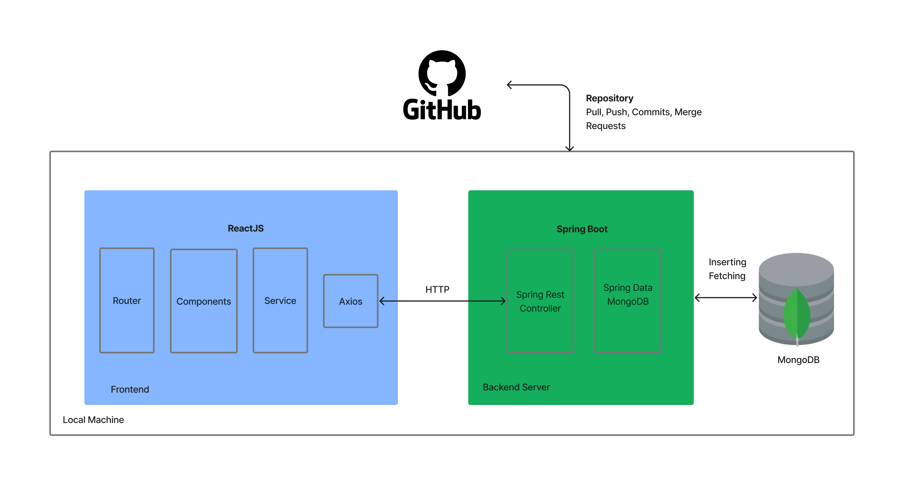
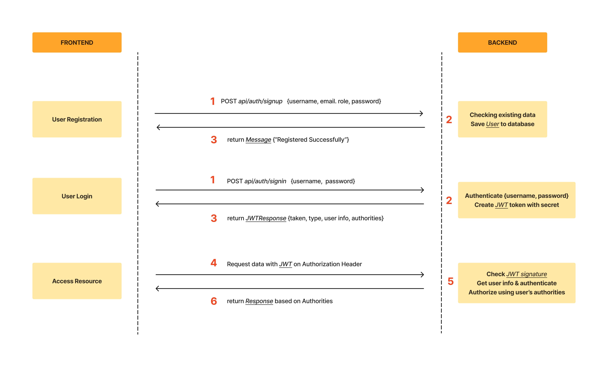

# springboot & react crud application with role-based authentication 



# Overview :globe_with_meridians:
In this application any type of user would be able to perform CRUD operations for the notes functionality where they can save notes which will be saved in the MongoDB compass database. In order to do this the user must first register an account then login and after a successful login the user will be able to see user specifc content. For example : if the user role is the moderator, after loggin in the moderator user can see the moderator dashboard in the navigation bar however the user with a user role would not be able to see that in their navigation bar. All user data will also be stored in MongoDB compass as a seperate collection and their passwords will be encrypeted using base64 and all user data will be stored including the role type.



# Features :white_check_mark:
- Basic CRUD operations
- Role-based authentication with JWT token
- User role specific content
- Search functionality
- Protected routing
- Error handling
- Dockerized 

## Prerequisites :white_check_mark:
- [x] Installation of Java 8 or above
- [x] Installation of Node (16 LTS)
- [x] Installation of Yarn package manager
- [x] Installation of Maven with path variable added
- [x] MongoDB Compass installed locally on running server in port 27017 (mongodb://localhost:27017)
- [x] Installation of Docker and docker-compose
- [x] Installation of Postman

## Post Installation :computer:
Before getting started we need to first configure some database configurations. Start the backend spring boot application using `mvn spring-boot:run`
Then open your MongoDB compass and open the `MONGOSH` terminal and enter the following commands in order. These commands switches to your database name and then adds `roles` to the roles collection.

```
1. use surge
2. db.roles.insertMany([
   { name: "ROLE_USER" },
   { name: "ROLE_MODERATOR" },
   { name: "ROLE_ADMIN" },
])
``` 

## Getting Started - Installation :computer:

```
Clone Repository
1.  git clone https://github.com/Chabbax/surge-practical-2022-sep.git

Backend
1.  cd backend
2.  mvn clean install   
3.  mvn spring-boot:run

Frontend
1.  cd frontend
2.  yarn
3.  yarn start
```

## User Registration, Login and Authorization process.


## Configuration

Make sure to add your own `mangoURI` from your [MangoDB](http://mangodb.com) database and put in  `config/default.json`.

```javascript
{
    "mongoURI": "YOUR_MONGO_URI_HERE",
    "secretOrKey": "secret"
}
``` 

## Spring Boot Rest API Architecture with Spring Security
You can have an overview of our Spring Boot Server with the diagram below:


For more detail, please visit:
> [Spring Boot, MongoDB: JWT Authentication with Spring Security](https://bezkoder.com/spring-boot-jwt-auth-mongodb/)

Working with Front-end:
> [Vue](https://www.bezkoder.com/jwt-vue-vuex-authentication/)

> [Angular 8](https://www.bezkoder.com/angular-jwt-authentication/) / [Angular 10](https://www.bezkoder.com/angular-10-jwt-auth/) / [Angular 11](https://www.bezkoder.com/angular-11-jwt-auth/) / [Angular 12](https://www.bezkoder.com/angular-12-jwt-auth/) / [Angular 13](https://www.bezkoder.com/angular-13-jwt-auth/)

> [React](https://www.bezkoder.com/react-jwt-auth/) / [React Redux](https://www.bezkoder.com/react-redux-jwt-auth/)

More Practice:
> [Spring Boot with MongoDB CRUD example using Spring Data](https://www.bezkoder.com/spring-boot-mongodb-crud/)

> [Spring Boot MongoDB Pagination & Filter example](https://www.bezkoder.com/spring-boot-mongodb-pagination/)

> [Spring Boot + GraphQL + MongoDB example](https://www.bezkoder.com/spring-boot-graphql-mongodb-example-graphql-java/)

Run both Back-end & Front-end in one place:
> [Integrate Angular with Spring Boot Rest API](https://www.bezkoder.com/integrate-angular-spring-boot/)

> [Integrate React with Spring Boot Rest API](https://www.bezkoder.com/integrate-reactjs-spring-boot/)

> [Integrate Vue with Spring Boot Rest API](https://www.bezkoder.com/integrate-vue-spring-boot/)

## Run Spring Boot application
```
mvn spring-boot:run
```
